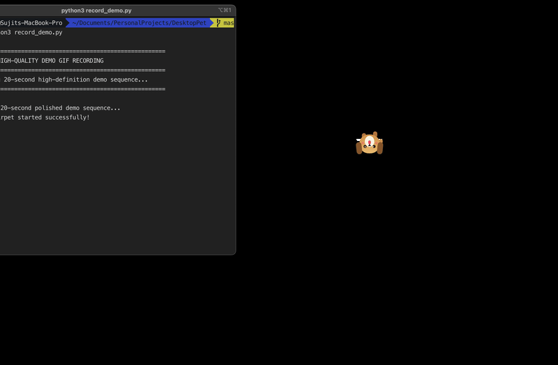

# 🐾 Chirpet - Native macOS Floating Companion & Fetch Game



> A vibrant, interactive, transparent macOS desktop pet companion built natively with **Swift**, **AppKit**, and **SwiftUI**. Your pet floats over all desktop windows and virtual spaces, follows your mouse pointer, fetches tennis balls across your screen, carries text notes, reminds you of scheduled tasks, and rests cozy in screen corners!

---

## 🗺️ Roadmap & Future Development

**Chirpet** is an active open-source project crafted out of love for desktop companions and native macOS development. Here is what is planned for future releases:

- [ ] **Expanded Pet Characters**: Panda (🐼), Shiba Inu (🐕), Red Panda (🦊), and Penguin (🐧).
- [ ] **Voice Memos & Custom Audio**: Record voice notes for task reminders and attach custom sound packs.
- [ ] **Wearable Pet Accessories**: Customizable hats, glasses, and bowties.
- [ ] **Interactive Desktop Toys**: Laser pointer tool, squeaky balls, and treats.
- [ ] **Apple Calendar & Reminders Integration**: Sync scheduled tasks directly with native macOS Calendar and System Reminders.
- [ ] **Multi-Pet Support**: Option to keep multiple companions on your desktop interacting with each other.

---

## ⭐ Support the Project

If **Chirpet** brought a smile to your face or made your workday a little more cheerful, consider dropping a ⭐️ **star on GitHub**. It helps more macOS users discover the project and inspires continued open-source development!

---

## 🌟 Key Features & Interactive Modes

| Mode / Feature | Icon | Description |
| :--- | :---: | :--- |
| **Active Mode** | 📍 | **Follow Mouse Pointer**: Pet continuously tracks the cursor location in real time with smooth lerp physics and direction flipping. |
| **Play Catch (Fetch Game)** | 🎾 | **2-Phase Fetch Sequence**: Click the pet to throw a tennis ball (`🎾`) across your screen. The ball glides to its landing spot, the pet pauses in excitement, sprints full speed with dust particles (`💨`), picks up the ball in its mouth (`🎾🐶`), and returns it to your cursor! Tracks your **Fetch Score** (`Catches: 5 🎾`). |
| **Scheduled Task Reminders** | ⏰ | **Custom One-Time & Repetitive Task Scheduler**: Schedule tasks with **any custom minutes or hours** chosen by the user! When a task reaches its trigger time, Chirpet automatically wakes up (even if sleeping/hidden), runs to your cursor, plays an audio alert sound, and displays your task text in an interactive reminder banner (`⏰ REMINDER: <title> [Done ✅]`). Menu bar checkmarks auto-sync in real-time. |
| **Adaptive CPU Optimization** | ⚡ | **Near 0% CPU Engine**: Dynamic frame rate switching (30 FPS active -> 5 FPS sleeping -> 1 FPS background task check) to ensure zero battery impact on your Mac! |
| **Home Corner Mode** | 🏠 | **Screen Corner Rest**: Pet walks automatically to a designated screen corner (Bottom-Right, Bottom-Left, Top-Right, Top-Left) and enters a cozy sleeping Zzz animation. |
| **Disable (Hidden)** | 👁️‍🗨️ | **Hidden Overlay**: Hides the floating windows completely and pauses update timers to conserve CPU and battery. |
| **Text Note Carrier** | 📝 | **Attach Reminders**: Attach text notes or reminders to your pet via the menu bar. The pet carries an interactive note speech bubble over its head! |
| **Pet Soundboard & Audio** | 🔊 | **Native Audio Reactions**: Integrated macOS sound effects (`NSSound` bark, purr, hero roar, pop) when petted, fetching the ball, or attaching notes. |
| **Ghost Mode / Hit-Testing** | 👻 | **Pass-Through Clicks**: Transparent window margins allow clicks straight through to desktop icons and background apps. Toggle 100% Click-Through anytime! |
| **macOS Status Item** | 🐾 | **Reactive Menu Bar Control**: Quick toggle status item in the top macOS menu bar with custom task modal dialogs, expanded quick presets (1m, 3m, 5m, 10m, 15m, 30m, 45m, 1h, 2h, 4h, 8h), real-time Combine state sync, character selection, speed sliders, and sound controls. |

---

## ⏰ Flexible Task Customization & Timing

Chirpet gives you complete control over task timing:
- **Custom Time Dialog**: Menu Bar 🐾 -> **`Custom Time & Task... 📝`** allows typing any custom number of minutes or hours (e.g. 3 minutes, 12 minutes, 45 minutes, 3 hours, 12 hours) for both One-Time and Repetitive tasks.
- **Expanded Quick Presets**: 1m, 3m, 5m, 10m, 15m, 30m, 45m, 1h, 2h, 4h, 8h.
- **Auto-Wake Reaction & Menu Sync**: If your pet is sleeping or hidden, Chirpet automatically wakes up, unchecks Resting Mode in the menu bar, sprints to your cursor, plays an alert sound, and displays the task text!
- **Dismissal & Recurrence**: Click the pet or task checkmark (`✅`) to dismiss. One-time tasks mark complete; repetitive tasks automatically recalculate their next due time.

---

## ⚡ Performance & CPU Optimization Architecture

Chirpet was designed to eliminate CPU & battery bottlenecks:

1. **Adaptive Frame Rate Engine**:
   - **Active & Catch Mode**: 30 FPS for silky-smooth animation and movement.
   - **Sleeping at Home**: 5 FPS (saves **83% CPU**).
   - **Disabled / Background**: 1 FPS (saves **97% CPU**, near **0% CPU** & zero battery impact!).
2. **WindowServer Composition**:
   - Windows call `orderOut(nil)` and `setIsVisible(false)` when hidden so macOS WindowServer performs zero composition work.
3. **Memory & Concurrency Safety**:
   - Particle buffer capped at 25 items; all calls isolated via `@MainActor`.

---

## 🐶 Character Roster

- 🐶 **Golden Retriever (Default)**: Prettier animated golden coat, bouncy floppy ears, sparkle eyes, wagging tail, running paws, and pink wagging tongue!
- 🐱 **Orange Tabby Cat**: Cute pointy ears, whisker mouth (`ω`), and wiggling tail.
- 🐉 **Pixel Dragon**: Mint wings, emerald scales, and yellow horns.
- 🐰 **Fluffy Bunny**: Soft white fur, tall pink-lined ears, and cute pink nose.

---

## 📁 Project Structure

```text
Chirpet/
├── Package.swift               # Swift Package Manager Manifest (macOS 13.0+)
├── README.md                   # Documentation & Features Showcase
├── Chirpet.app                 # Standalone macOS Application Bundle
├── Chirpet.dmg                 # Disk Image Installer
└── docs/
    └── assets/
        └── demo.gif            # Promotion-ready 20-second high-definition demo animation
```

---

## 🚀 Getting Started

### Prerequisites
- macOS 13.0 (Ventura) or later
- Xcode 14.0+ or Swift 5.9+ Command Line Tools (`swift --version`)

### Build & Run Instructions

1. Navigate to the repository root directory:
   ```bash
   cd Chirpet
   ```

2. Build and run the debug executable:
   ```bash
   swift build
   swift run
   ```

3. (Optional) Build the release binary & macOS `.app` bundle:
   ```bash
   swift build -c release
   ```

---

## 📦 Installation via Disk Image Installer

1. Double-click `Chirpet.dmg` in Finder.
2. Drag `Chirpet.app` to your **Applications** folder.
3. Open `Chirpet` from your Applications folder!

---

## 🎮 Controls & Shortcuts

| Action | Shortcut / Method |
| :--- | :--- |
| **Play Catch / Throw Ball** | Click the pet while in `Play Catch 🎾` mode |
| **Pet / Give Love / Dismiss Task** | Click the pet or task checkmark button (`✅`) |
| **Custom Time & Task** | Menu Bar 🐾 -> **Custom Time & Task... 📝** (or `⌘ + M`) |
| **Attach / Edit Note** | Menu Bar 🐾 -> **Attach Text Note 📝** (or `⌘ + N`) |
| **Pass-Through Clicks (Ghost Mode)** | Menu Bar 🐾 -> **Pass-Through Clicks** (or `⌘ + T`) |
| **Quit Application** | Menu Bar 🐾 -> **Quit Chirpet** (or `⌘ + Q`) |

---

## 📄 License

Created for personal desktop enjoyment. Free to customize, extend, and share! 🐾
